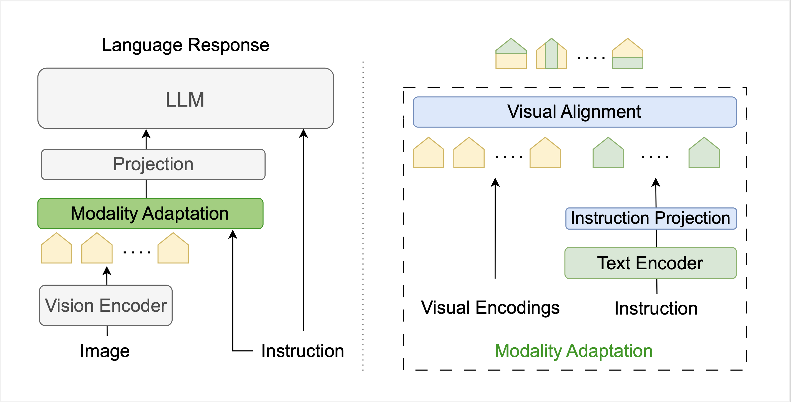
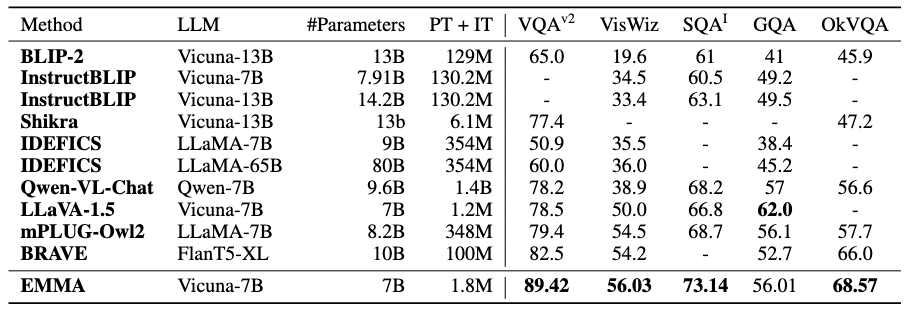
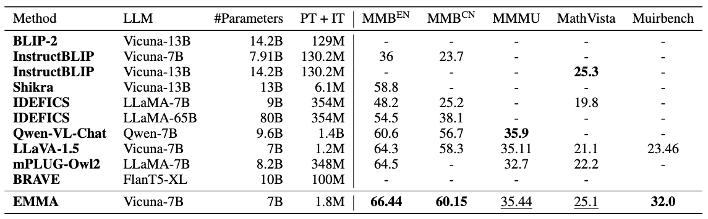
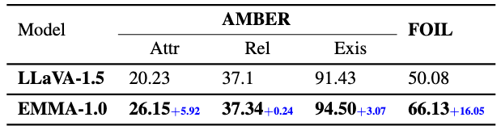

# EMMA: Efficient Visual Alignment in Multi-Modal LLMs

### [Paper](https://arxiv.org/abs/2410.02080) | [Results](#results) | [Dataset](#data) | [Checkpoints](#checkpoints) | [Acknowledgement](#ack)
We introduce EMMA (Efficient Multi-Modal Adaptation), which
performs modality fusion through a lightweight modality adaptation mechanism.
<div align="center">

</div>
Our contributions can be summarized as follows:

- **Efficient Modality Adaptation**: We introduce a lightweight modality adaptation mechanism that refines visual representations with less than a 0.2\% increase in model size, maintaining high efficiency without compromising performance.

- **Comprehensive Analysis of Visual Alignment**: We conduct an in-depth investigation of the Visual Alignment module to provide (1) a detailed understanding of how visual and textual tokens are integrated and (2) an analysis of how effectively the aligned visual representations attend to instructions compared to the initial raw visual encodings.
  
- **Extensive Empirical Evaluation**: We perform a comprehensive evaluation on both general and MLLM-specialized benchmarks, demonstrating that EMMA significantly improves cross-modal alignment, boosts task performance, and enhances the robustness of multi-modal LLMs.
  
- **EMMA Outperforms Larger Models**: Compared to mPLUG-Owl2 which has $50\times$ larger modality adaptation module and is trained on $300\times$ more data, EMMA outperforms on 7 of 8 benchmarks. Additionally, compared with BRAVE which has $24\times$ larger vision encoder and is trained on $100\times$ more data EMMA outperforms on all benchmarks.

<a name="results"></a>
### Results 
- General Benchmarks

<div align="center">

</div>

- MLLM Specialized Benchmarks

<div align="center">

</div>

- Hallucinations
<div align="center">

</div>

<a name="data"></a>
### Dataset

- Pretraining: LLaVA [PT](https://huggingface.co/datasets/liuhaotian/LLaVA-Pretrain) data 
- Instruction Tuning: LLaVA [IT](https://github.com/haotian-liu/LLaVA/tree/main?tab=readme-ov-file#visual-instruction-tuning) data + [LVIS-Instruct4V](https://huggingface.co/datasets/X2FD/LVIS-Instruct4V) + [CLEVR](https://cs.stanford.edu/people/jcjohns/clevr/) + [VizWiz](https://vizwiz.org/tasks-and-datasets/vqa/) + [ScienceQA](https://scienceqa.github.io/)

<a name="checkpoints"></a>
### Checkpoints
- Clone the project

```
https://github.com/SaraGhazanfari/EMMA.git
```
- Clone the checkpoint
```
cd EMMA
git clone https://huggingface.co/saraghznfri/emma-7b
mv emma-7b/bpe_simple_vocab_16e6.txt.gz llava/model/multimodal_encoder/
```
- Now the scripts can be used for the evaluations
<a name="ack"></a>
### Acknowledgement
We build our project based on [LLaVA](https://github.com/haotian-liu/LLaVA): an amazing open-sourced project for vision language assistant

